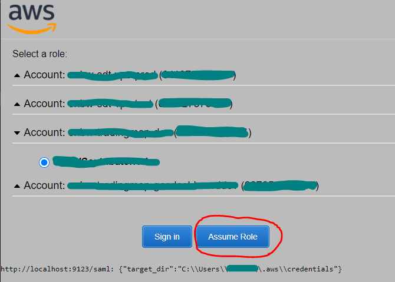

Create temporary AWS security credentials from a SAML authentication response.

1. You are using federated login to your AWS account, possibly using Single Sign On and Multi-Factor Authentication.
2. Typically you navigate to a enterprise login page.
3. This login page will eventually redirect you to the Amazon Web Services Sign-In page.
4. From there you select the AWS account and role for which to open the AWS Console.

The assume_role_with_saml project provides a Chrome Extension content script adding an `Assume Role` button to Amazon Web
Services Sign-In page:


Clicking the `Assume Role` button calls a small local web server, which writes temporary AWS credentials to the shared
credential file (~/.aws/credentials).

⚠ The Chrome Extension content script is only attached to the page https://signin.aws.amazon.com/saml.
If your redirect-page is different, then this project will not work.

# Setup

You install less than 150 lines of code with no external dependencies except `boto3`, which you probably need anyway.

1. Clone this project.
2. Optionally create virtual environment and install boto3.
3. Add this Chrome Extension according to [Getting started - Chrome Developers](https://developer.chrome.com/docs/extensions/mv2/getstarted/#manifest):
    1. Open the Extension Management page by navigating to chrome://extensions.
    2. Enable Developer Mode by clicking the toggle switch next to Developer mode.
    3. Click the LOAD UNPACKED button and select the project (=extension) directory.

# Configure

Provide a starter script (I call it `my_assume_role.py`) of the form

````
import webbrowser
import server

# Optionally open sso page
webbrowser.open_new('https://my_enterprise_login_page')
server.run(identity_provider_name='my_identity_provider_name')
````

You get a list of Identity providers on [AWS IAM -> Identity providers](https://console.aws.amazon.com/iamv2/home?#/identity_providers)
or with

````
import boto3, pprint
pprint.pprint(boto3.client('iam').list_saml_providers())
````

# Run

My prefered way on MS-Windows is a shortcut amounting to
````
cd c:/ws/projects/assume_role_with_saml
venv/scripts/python.exe my_assume_role.py
````

# Security Considerations

Due to its local nature, no attack vectors are added.

However, a user may inadvertently click the `Assume Role` button. The user will then not realize that the
shared AWS credentials were changed. AWS SDK API calls may now run on an account the user does not expect.

⚠ The Chrome extension is **not** on the Chrome Web Store, because extensions there are notoriously difficult to audit.
Instead, I urge you to install the extension locally **after** you do a code audit.  

# Related Work

* https://boto3.amazonaws.com/v1/documentation/api/latest/guide/credentials.html
* https://github.com/prolane/samltoawsstskeys
* https://chrome.google.com/webstore/detail/console-recorder-for-aws
* https://github.com/sportradar/aws-azure-login
